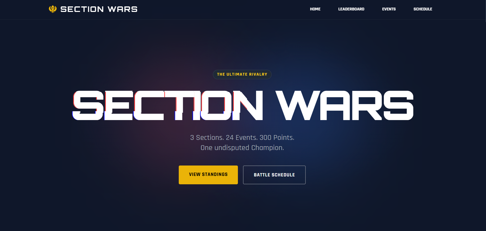
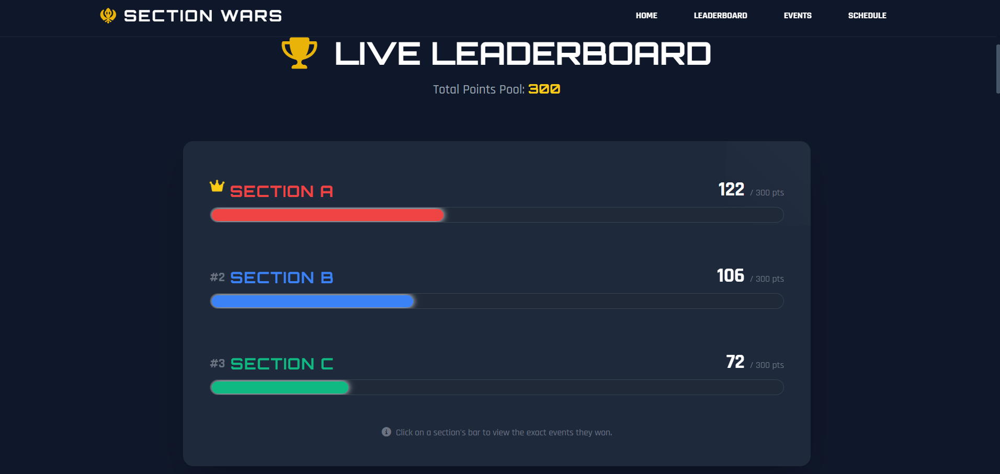
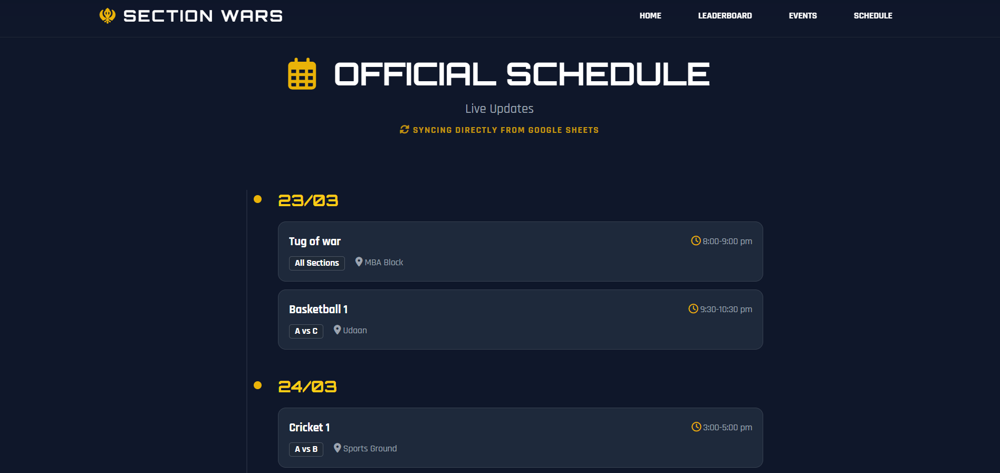
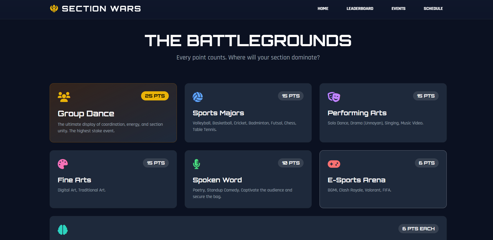

# 🏆 Section Wars

<div align="center">

## Live Event Tracking & Leaderboard Platform

A real-time web application built for **IIM Bodh Gaya's Section Wars**, enabling students to follow live standings, event schedules, and competition updates throughout the tournament.

---



</div>

---

## Overview

Section Wars is a dynamic event website developed to serve as the central information hub for an inter-section competition.

Instead of manually updating webpages whenever scores changed, the platform synchronizes directly with **Google Sheets**, allowing organizers to manage schedules and leaderboard updates in real time without touching the code.

Students can simply refresh the website to view the latest rankings, event timings, and competition details.

---

# ✨ Features

### 🏆 Live Leaderboard

- Automatic score calculation
- Live standings
- Animated progress bars
- Ranking system
- Section-wise event breakdown
- Modal showing events won by each section



---

# 📅 Live Schedule

The competition schedule is loaded directly from Google Sheets and displayed as a clean timeline.

Features include

- Date-wise grouping
- Event timings
- Matchups
- Venue information
- Automatic updates
- Mobile-friendly timeline



---

# 🎯 Events Overview

Displays every competition category along with its point distribution.

Includes

- Sports
- Performing Arts
- Fine Arts
- E-Sports
- Spoken Word
- Mind & Muscle
- Group Dance



---

# ⚡ Real-Time Google Sheets Integration

One of the key goals of this project was to eliminate manual website updates.

The application fetches live data directly from public Google Sheets using **PapaParse**, allowing organizers to manage the competition using familiar spreadsheet tools.

### Live Data Sources

- Leaderboard
- Schedule
- Event Results

No backend server is required.

---

# 🚀 Features

- Live leaderboard
- Automatic point calculation
- Google Sheets integration
- Interactive event cards
- Animated ranking bars
- Section performance modal
- Timeline-based schedule
- Responsive design
- Smooth scrolling navigation
- Mobile optimized
- Dark esports-inspired interface

---

# 🖥 Tech Stack

## Frontend

- HTML5
- Tailwind CSS
- JavaScript (ES6)

## Libraries

- PapaParse
- Font Awesome

## Data Source

- Google Sheets API (CSV Export)

---

# 📂 Project Structure

```text
Section-Wars
│
├── docs/
│   ├── sectionwars.png
│   ├── leaderboard.png
│   ├── schedule.png
│   └── events.png
│
├── index.html
└── README.md
```

---

# 🎨 UI Highlights

- Futuristic gaming-inspired interface
- Orbitron typography
- Animated progress bars
- Responsive layout
- Interactive leaderboard
- Timeline visualization
- Dark theme
- Hover animations
- Smooth transitions

---

# 📊 Google Sheets Workflow

```
Organizer
      │
      ▼
Google Sheets
      │
      ▼
CSV Export
      │
      ▼
PapaParse
      │
      ▼
Section Wars Website
      │
      ▼
Live Leaderboard & Schedule
```

This workflow allows non-technical organizers to update the website simply by editing a spreadsheet.

---

# 📱 Responsive Design

The application is fully responsive and optimized for

- Desktop
- Laptop
- Tablet
- Mobile devices

---

# Future Improvements

- Admin dashboard
- Event result submission portal
- Authentication
- Live notifications
- Match result history
- Section statistics
- Countdown timers
- Event filtering
- Automatic refresh without page reload
- Firebase/WebSocket integration

---

# Inspiration

The goal was to build a competition website that looked more like an esports tournament portal than a traditional college event page while remaining simple enough for organizers to maintain through Google Sheets.

---

# Developed By

**Raghunandan Dasa**

Developed for the Section Wars event at **IIM Bodh Gaya**, combining a modern UI with lightweight real-time data synchronization through Google Sheets.
